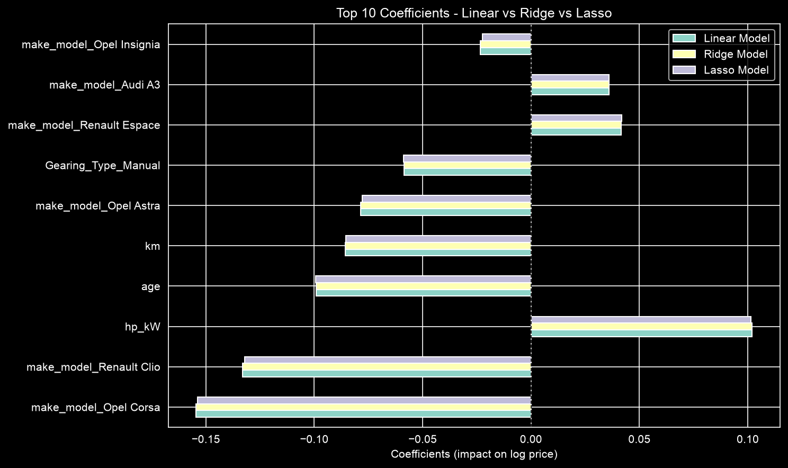

# Resale Car Price Prediction

Predicting the listing price of used cars with **Linear, Ridge and Lasso regression**, and finding out which car features drive the price.

The final model explains about **93% of the variation in price** on cars it has never seen, with a typical error of about **€1,485 (around 8% of the average price)**.

---

## Problem

A used car reseller needs to price cars accurately: high enough to keep a margin, low enough to attract buyers. This project builds a regression model that predicts a car's price from its details (make, age, mileage, engine, equipment and so on). It also tests whether regularisation (Ridge and Lasso) helps the model generalise to new cars.

## Dataset

- **Source:** AutoScout, a German online car marketplace (publicly available on Kaggle)
- **Size:** 15,915 listings × 23 columns
- **Target:** `price` in euros (€4,950 to €74,600, average about €18,000)
- **Coverage:** 9 car models from 3 brands (Audi, Opel, Renault), all 0 to 3 years old
- Four columns (`Comfort_Convenience`, `Entertainment_Media`, `Extras`, `Safety_Security`) store equipment as comma-separated lists

## Approach

1. **Data quality:** no missing values were found. Zeros (age, owners, km) were checked and confirmed as real values.
2. **Cleaning:**
   - Category levels with under 5% of rows were merged into "Other".
   - The `Type` column was grouped into *Used* and *New-Like*.
   - Price was log-transformed, because it was right-skewed (skew 1.24 → −0.03).
3. **Outliers:**
   - Statistical outliers (IQR rule) were kept, because they are real cars.
   - 5 impossible records (cars under one year old with over 50,000 km) were removed.
4. **Feature engineering:**
   - The equipment lists were split into yes/no columns, keeping items found in 5–95% of cars (71 features).
   - Categories were one-hot encoded.
   - The data was split 70/30 into training and test sets, then standardised.
5. **Multicollinearity:** a VIF check found that two derived features (`hp_to_weight`, `km_per_year`) were near-copies of existing columns, so they were removed. The final model uses 100 features.
6. **Models:** a Linear Regression baseline, then Ridge and Lasso, with alpha tuned using 5-fold cross-validation (coarse search, then fine search).

## Results

| Model | Alpha | Test R² | Test RMSE | Test MAE | Features used |
|---|---|---|---|---|---|
| Linear Regression | – | 0.928 | €2,316 | €1,485 | 100 |
| Ridge | 0.001 | 0.928 | €2,316 | €1,485 | 100 |
| **Lasso (final)** | **0.0001** | **0.928** | **€2,316** | **€1,485** | **99** |

- **No overfitting:** training R² was 0.931 against test R² of 0.928.
- **Regularisation didn't improve accuracy,** because there was no overfitting to fix: plenty of data (about 11,000 training rows for 100 features) and careful feature preparation.
- **Lasso was chosen:** it matches the other models while using one feature fewer (it dropped `ex_Roof rack`).

### What drives the price



- **Car model:** compared with the Audi A1, the Opel Corsa, Renault Clio and Opel Astra are cheaper; the Renault Espace and Audi A3 are more expensive.
- **Engine power** raises the price; **age** and **mileage** lower it.
- A **manual gearbox** lowers the price.
- A new inspection and the fuel type make almost no difference.

## Project structure

```
├── RR_Car_Price_Prediction_Sibtain_Raghib.ipynb   # full analysis and models
├── data/
│   └── Car_Price_data.csv                         # dataset
├── images/                                        # all plots saved by the notebook
└── README.md
```

## How to run

1. Install **Python 3.12 or newer**. The notebook uses f-string syntax added in 3.12.
2. Install the libraries:
   ```bash
   pip install pandas numpy matplotlib seaborn scikit-learn scipy jupyter
   ```
3. Open the notebook and run all cells:
   ```bash
   jupyter notebook RR_Car_Price_Prediction_Sibtain_Raghib.ipynb
   ```
   The plots are saved to `images/`.

## Limitations

- The data covers only 9 models from 3 brands, aged 0 to 3 years, from one German website. The model shouldn't be used for older cars, other brands or other markets.
- Errors grow with price, so expensive cars should be checked by hand.
- A model that can capture interactions between features (for example, tree-based models) could reduce the larger misses on high-priced cars.

## Tools

Python · pandas · NumPy · scikit-learn · Matplotlib · Seaborn · SciPy

---

*Built by Sibtain Raghib as part of the upGrad Machine Learning programme (Regularised Regression assignment).*
